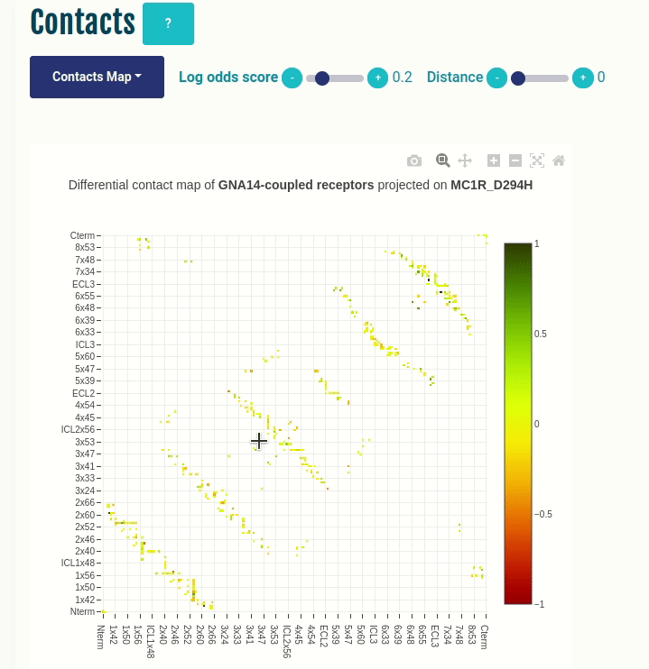
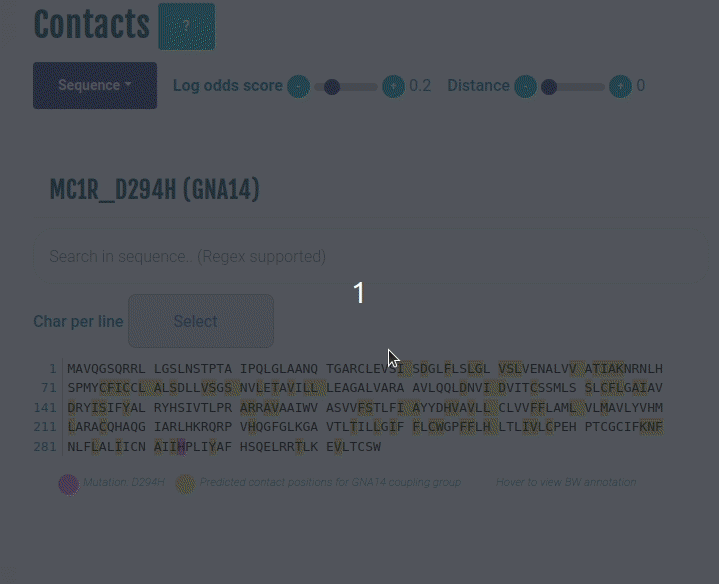

<div align="center">

</div>

The protein language models encode structural and functional information of GPCR sequences that can be used to predict their signaling and functional repertoire. Here, we used the  as features and the binding information known from publicly available datasets to develop PRECOG<strong style="color: darkorange">x</strong>, an ML-guided tool of exploring GPCR signaling mechanisms with deep protein representations. PRECOG<strong style="color: darkorange">x</strong> allows users to:
1. Predict GPCR (all classes) interactions with G protein and β-arrestin
2. Project input sequences on an low-dimensional embedded space describing essential features of the human GPCRome
3. Inspect sequence and structural determinants responsible for coupling via the analysis of the most important attention maps used by the models and through predicted intramolecular contacts
4. Assess the impact of disease variants and alternative splice forms of human GPCRs

Explore .
___

### Table of Contents
1. [File organization](#fileOrganization)
2. [How to run PRECOGx?](#howToRunPRECOGx)
3. [Output page of the web application](#outputPageOfTheWebApplication)
4. [Output of the command-line application](#outputPageOfTheCommanLineApplication)
5. [Legacy version](#legacy)
6. [Contacts](#contacts)

___

### File organization <a name='fileOrganization'></a>
```data```: Files/folders required to run the applications (mostly loaded in the run.py script)

```templates```: HTML templates to load the home, output, result, etc pages

```static```: JS, CSS, .py files to implement the web and the command-line applications

```.github/workflows```: Workflow to fetch the latest 3D complexes (from PDB) of GPCR/G-protein (β-arrestins) and generate mappings/annotations, which are used by various functions of the web application.

___

### How to run PRECOGx? <a name='howToRunPRECOGx'></a>

<details><summary>If you wish to access the webserver</summary>

Open the [URL]("https://precogx.bioinfolab.sns.it")
</details>

<details><summary>If you wish to run the web application locally on your system</summary>

1. Clone the repository and install Flask.

```
git clone <repo>
pip install Flask
```

2. Create the PRECOGx environment with conda.
```
conda env create -f environment.yml
conda activate precogx
```
This will create and activate the environment named <b>precogx</b>

3. Launch the webserver.
```
python3 run.py
```
</details>

<details><summary>If you wish to run the command-line application locally</summary>

1. Clone the repository and install Flask.

```
git clone <repo>
pip install Flask
```

2. Create the PRECOGx environment with conda.
```
conda env create -f environment.yml
conda activate precogx
```
This will create and activate the environment named <b>precogx</b>

3. Run PRECOGx.
Go into the precogx directory, and run:
```
./static/predictor/precogx.py all --file <inputFile>
```
or try:
```
./static/predictor/precogx.py --help
```
to know more.

```
python3 run.py
```
</details>

___

### Output page of the web application (local or via the webserver) <a name="outputPageOfTheApplication"></a>

<details><summary>Coupling probabilities</summary>

1. This panel displays the predicted probabilities of each input sequence as well as the experimental information provided by , , and  biosensors.
2. To visualise information related to a G-protein/β-arrestin coupling, simply click the corresponding cell in the table, and other panels will update accordingly.
</details>

<br>


<details><summary>PCA</summary>

1. This panel displays the projections of the human GPCRome sequences along with the first two principal components obtained by performing the Principal Component Analysis (PCA) on the embeddings of the human GPCRome (377 receptors) for different layers.
2. The user can label the human GPCRome based on their known functional information with the help of a drop-down menu.
3. If either TGF or GEMTA biosensor is selected from the drop-down, a continuous colour gradient, ranging from dark grey (no binding) to green (maximum binding), will be applied.
4. If GtoPdb is selected, a discrete colour will be applied: dark green (primary transduction mechanisms) and pale green (secondary transduction mechanisms).
5. If Class is selected, a discrete set of colours will be applied to display different GPCR classes.
6. Wild type and mutated (if provided) sequences are highlighted in, khaki and fuchsia, respectively.
</details>
<br>


<details><summary>Contacts</summary>

1. Differential Contact Pairs (coupled vs not-coupled receptors for a given G-protein) are obtained using the ESM library, mapped to their BW annotations, and shown in the heatmap
2. Users can use the slider to filter the contact pairs based on their log-odds scores
3. Contact pairs enriched for a coupling group (observed in coupled receptors) are coloured in green and the depleted (observed in not-coupled receptors) ones in red
1. This panel displays predicted differential contacts for a given coupling group (G-protein/β-arrestin), which can be selected by clicking on any cell in the Coupling probabilities table (see above).
2. The predicted contacts for each input receptor are grouped together on the basis of specific coupling preferences and summarised via the log-odds ratio, indicating contacts that are more (shown in green) or less (red) frequently than expected observed.
3. Contact statistics is referenced to [GPCRdb]("https://gpcrdb.org/”)  generic residue numbering system.
4. The Log-odds score slider can be used to filter and visualize the predicted contacts with a log-odds ratio greater than the user-specified absolute value (default: 0.2). The Distance slider can be used to filter close contact pairs inside the same secondary structural element(helices) (default: 0).
</details>
<br>



<details><summary>Sequence/Attention map</summary>

1. By selecting Sequence from the drop-down, the positions mediating predicted contacts (highlighted in yellow) for the selected coupling group (G-protein/β-arrestin) are mapped onto the input sequence and displayed to the user.
2. The Log odds score slider can be used to filter and visualize the predicted contacts with a log-odds ratio greater than the user-specified absolute value. Hovering over any highlighted position to view its BW numbering. Mutation, if provided, is highlighted in magenta.
3. By selecting the Attention map from the drop-down, the attention map derived from the most important attention head of the best performing embedding layer during classification is displayed to the user. The user can compare the attention network of mutation with the wild type (the labels on the X- and Y-axis represent the input sequence positions).
</details>
<br>



<details><summary>Structure</summary>

1. This panel displays the predicted differential contacts of the input sequence on a 3D structure of GPCR - G-protein/β-arrestin complex.
2. The predicted contacts positions are highlighted as yellow spheres with their diameter proportional to the number of predicted contacts they mediate (the labels indicate the corresponding GPCRdb generic numbering system of the contact).
3. The green and red edges represent predicted contact pairs that enriched or depleted, respectively, for the given coupling group (G-protein/β-arrestin).
4. Mutation (if provided) is highlighted as a magenta-coloured sphere. The 3D structure with the highest sequence identity to the input GPCR (using PSI-BLAST against PDB-derived and AlphaFold complexes) is chosen and displayed by default.
5. The user can also choose another 3D structure from the dropdown menu, which has the list of 3D structures (PDB-ID/AlphaFold pairs) in descending order of sequence identity with the input receptor.
6. The user can also use the Log-odds score slider to filter and visualize the predicted contacts with a log-odds ratio greater than the user-specified absolute value. The Distance slider can be used to filter close contact pairs inside the same secondary structural element(helices).
7. Additional toggle options are available within the NGL viewer.
</details>
<br>


___

### Output of the command-line application <a name="outputPageOfTheCommanLineApplication"></a>

This is the description of the output you will obtain if you run the command-line application or download the output from the web application.<br>

Column information:<br>

<strong>GPCR</strong>: Input name(s) provided by the user<br>
<strong>VAR</strong>: Type of variants - (a) Wild type; (b) Variant; (c) GtoPdb; (d) LogRAi-TGF; (e) Emax-GEMTA<br>
<strong>[GNAS - β-arr/GRK2]</strong>: PRECOGx-predicted coupling probabilities (both wild type and variants) for the available G-proteins and β-arrestins groups<br><br>

Rows information:<br>

|<strong>VAR</strong>|<strong>Description</strong>|
|-----|----|
| GtoPdb | Information known about the given GPCR known from GtoPdb/IUPHAR|
|LogRAi-TGF| Information known about the input GPCR from the <strong>TGFɑ shedding assay</strong> experiment|
|Emax-GEMTA|Information known about the input GPCR from the <strong>ebBRET assay</strong> experiment|
|P(WT)| PRECOGx-predicted coupling probabilities of the given GPCR|
|P(variant)| PRECOGx-predicted coupling probabilities of the variant in the given GPCR (eg: D294H - Aspartic acid at sequence position 294 mutated to Histidine)|

___

### Legacy version <a name="legacy"></a>
PRECOG (legacy version) can be found 

___

### Contacts <a name="contacts"></a>
Francesco Raimondi: francesco.raimondi@sns.it<br>
Marin Matic: marin.matic@sns.it<br>
Gurdeep Singh: gurdeep.singh@bioquant.uni-heidelberg.de

Use [Issues](https://github.com/raimondilab/precogx/issues) to suggest features or report errors/problems.
